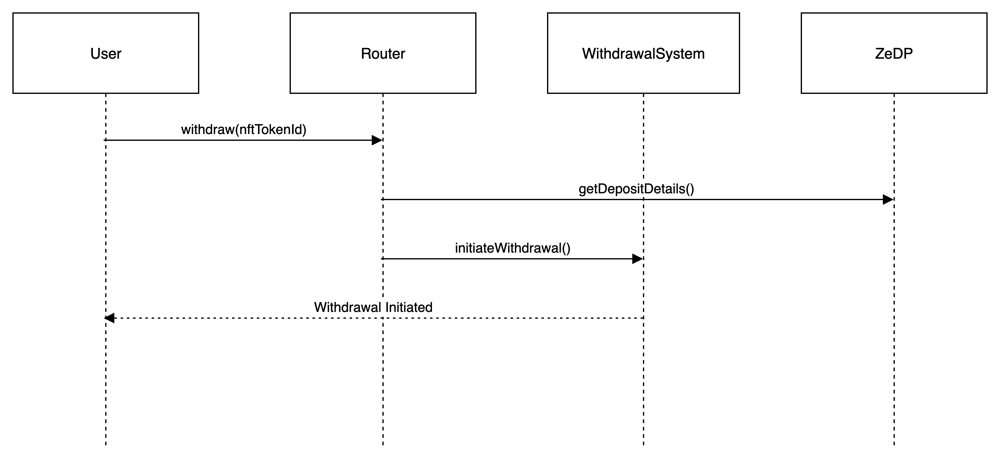

# Invoice Discounting & Global Trade Finance

## **Introduction**

**Invoice discounting** is post-sales funding meaning that funding should happen once sales has been done and goods/services delivered.

### **Benefits to Investor**

* Opportunity to earn a high fixed return in a short period of time
* Form of working capital finance hence less risky as the company needs constant funding to run the business
* Short-tenor products and funds can be parked in for a few months (1 Month – 6 Months)
* Unlike equity/mutual funds, investing via lease isn’t controlled by market sentiment.
* Allows small ticket-size investments
* Secured funding backed by invoice
* Opportunity to invest in invoices raised to/by creditworthy customers.

Zoth has designed its offerings of Invoice Discounting, including global trade finance to meet the requirements of:

1. A borrower looking for funds in USDC/ Stablecoin
2. A borrower looking for funds in Fiat (only USD) currency

|                  | **Funding in USDC/ Stablecoin**                                                                                                                                                                                                                                                                                                                                                            | **Funding in Fiat (only USD) - Leverage own SPV**                                                                                                                                                                                                                                                                                                                                                                                                                                                                                                                                                                                                                                                                                                                                                                                                               |
| ---------------- | ------------------------------------------------------------------------------------------------------------------------------------------------------------------------------------------------------------------------------------------------------------------------------------------------------------------------------------------------------------------------------------------ | --------------------------------------------------------------------------------------------------------------------------------------------------------------------------------------------------------------------------------------------------------------------------------------------------------------------------------------------------------------------------------------------------------------------------------------------------------------------------------------------------------------------------------------------------------------------------------------------------------------------------------------------------------------------------------------------------------------------------------------------------------------------------------------------------------------------------------------------------------------- |
| Fund Flow        | USDC/Stablecoin from Lender to Borrower via Zoth protocol.                                                                                                                                                                                                                                                                                                                                 | 1) Lender/Investor to lend in USDC to Zoth Panama entity   2) Zoth Panama to Zoth SPV in Fiat   3) Zoth SPV to Borrower in USD                                                                                                                                                                                                                                                                                                                                                                                                                                                                                                                                                                                                                                                                                                                                  |
| Operating Models | **Direct Model**   1) Both Lenders & Borrowers will be onboarded on Zoth’s Platform   2) Zoth would perform the initial assessment of Borrowers and shares the insights with Lenders for informed decision making   3) Lenders will perform their own due diligence and risk assessment  and makes the investment decisions                                                                | **Direct Model**  1) Both Lenders & Borrower will be onboarded on Zoth’s Platform   2) Zoth would perform the initial assessment of Borrower and shares the insights with the Lenders   3) The borrower will list their requirements (Invoices/Trade finance requirement) on Zoth platform   4) Lender will lend USDC to Zoth Panama and Zoth Panama entity lend this USDC or converted USD to Zoth SPV in Singapore 5) Zoth SPV will fund the borrower post a detailed due diligence on the borrower, borrower’s customer and invoice   6) Zoth will enters into a lending agreement with borrower   Zoth would own the risk and default management and would ensure assured returns to the lender through a robust risk monitoring and mitigation strategies at every stage of the deal lifecycle & default management strategies including taking insurance. |
|                  | **Partner Model**  1) Lenders, Lending Partners & End Borrowers will be onboarded on Zoth’s Platform   2) Zoth would perform the initial assessment of Partner along with the end borrowers & their invoices and shares the insights with Lenders for informed decision making   3) Lenders will perform their own due diligence and risk assessment  and makes the investment decisions   | **Partner Model**  1) Lenders, Lending Partners & End Borrowers will be onboarded on Zoth’s Platform   2) Zoth would perform the initial assessment of Partner along with the end borrowers & their invoices and shares the insights with Lenders for informed decision making  3) The Lending Partner will list their lending requirements (Invoices/Trade finance requirement) on Zoth protocol   4) Lender will lend USDC to Zoth Panama and Zoth Panama entity lend this USDC or converted USD to Zoth SPV in Singapore 5) Zoth SOV will fund the lending partner post detailed due diligence on the lending partner and their investments.   6) Zoth will enters into a lending agreement with Lending Partner.   The lending partner would own the risk and default management and would ensure assured returns to Zoth & the lenders.                    |

Irrespective of whether it is Funding in USDC/Stable Coins or Funding in Fiat, the tenets of direct and partner models adopted will largely remain the same. The detailed process adopted is outlined below:

## **Direct Model**

### **Evaluation Process**

<figure><figcaption></figcaption></figure>

### **Stage 1: Onboarding**

**Onboarding of founder/promoter & borrower entity & data collection (First time onboarding)**

The key objective here would be to understand

1. Industry & business model
2. Company & management/promoters/founders
3. Capability to repay

Two Independent teams would be leveraged for onboarding approval:

* Zoth Internal team
* On-chain validators

_Zoth Internal team would perform:_

**1) Comprehensive Data Collection:** Zoth will collect the data about the borrower (supplier)  and the buyer (customer of the borrower) on its platform

2. **Founder/Promoter Interview and Reference Check:** Interview the founder/promoter of the borrower entity, connect with minimum two personal/professional references of the founder/promoter and capture their feedback.

Zoth will carry out company Due diligence based on information available in primary & secondary market domains & leveraging databases and promoters/management credibility.

We assess the company’s ability to withstand external & internal risks like revenue visibility, growth & repeat business, margin & profitability metrics, supply-demand metrics, concentration risk on single customer/ client. We choose the right partner by conducting due diligence of partner, management, and financial performance.

We understand business moat, competitive advantage, and strategies adopted by the company.

**Company’s capability to repay its loan from 5 major sources i.e.**

1. Business income (least risk)
2. Cash in hand (Lower risk)
3. Debt funding (what’s the current debt equity ratio, whether they can get more debt funding) (low risk)
4. Shareholder’s support - the presence of strategic investor (risk)
5. External equity - any plans for fund raise (external & uncertain factors)

In addition to this, Zoth will leverage a 3rd party on-chain validator to perform the initial independent assessment and will reconcile the findings.

**1.2 Onboarding of Asset from Borrower**

Zoth will execute a few validations of the details in the invoice & PO submitted for either discounting or factoring

### **Stage 2: Pre-Sanction Assessment/ Credit approval process**

Zoth would perform an initial evaluation and provide In-principle approval and then work focus on

**2.1 Level 1 Assessment - Data-Driven Risk Assessment**

Zoth will be leveraging its own proprietary AI-enabled credit scoring engine to drive the data-driven risk assessment.

**Key Steps**

**Borrower (Supplier) Assessment:** Following our onboarding procedure, a thorough evaluation of the suppliers will be conducted. To determine their eligibility, the suppliers' financial records and outside sources will be consulted. According to our protocol, a complete evaluation of the supplier is required. Each supplier will be given an internal risk rating based on this research and our process, showing their creditworthiness and accordingly interest rate will be determined.

**Borrower’s Customer (Buyer) Assessment:** Similar to how the suppliers were evaluated, the buyers will also be evaluated to determine their financial health and payment practices to ensure that they have the necessary funds to accurately and promptly pay the invoice amount. Following our procedure, several useful data sources will be used, enabling us to assign an internal risk rating to each buyer.

**Invoice Evaluation:** Every invoice will be evaluated separately in accordance with our internal credit policy and unique eligibility requirements, also validate if the invoice is backed by a valid agreement and purchase order. According to our methodology, a grade will be assigned based on the risk profiles of the buyer and supplier as well as the attributes of the invoice (such as the amount, tenor, etc.). As a result, the supplier will be presented with a reasonable rate of interest in accordance with the protocol's rules and algorithm.

**2.2 Second Level Due Diligence**

**Committee Review:** We will randomly select a few approved and rejected proposals and present to the Approval committee to avoid any algorithm bias.

### **Stage 3: Approvals & Collections**

**Approvals:**

Zoth would adopt a governance framework enabling all DAO participants to collectively vet each listing application and make a collective decision to process the asset/ deal.

Also would adopt a digital contract process.

**Collection:** Zoth would adopt an auto collections method (eg. eNach/ Standing Instructions) to ensure timely collection, irrespective of whether the borrower gets his invoice paid.

**Stage 4: Post-Sanction Assessment**

Zoth will continue to assess the risks post the disbursement of the funds to the borrower to minimize the default risk.

**Portfolio Management**: Zoth would conduct a periodic review of the portfolio and diversify the portfolio to ensure that the impact of any default could be minimized.

**Continuous Risk Monitoring:** Zoth would continuously monitor key variables that could have an adverse impact on the business of the borrower (Supplier) and Buyer and assign updated credit rating scores.

#### \*\*\*\*

#### **Risks and Mitigation Strategies:**

Zoth has identified potential risks and defined appropriate mitigation strategies adopting industry best practices

**Credit Risk:**

The inability of the Buyer Company to pay the amount owed due to its financial status. Zoth Credit risk team performs financial due diligence, which includes a detailed credit analysis leveraging an AI-powered proprietary credit risk assessment engine on the buyer company.

**Fraud Risk:**

Even though new risk mitigation techniques have been implemented to combat fraud, the invoice discounting industry is still in danger. We, as a discounting platform, also have to deal with a number of convergent trends that have increased the scope and sophistication of fraud in recent years, in addition to the traditional fraud categories that have long plagued the sector.

To stop both new and existing fraud, Zoth has implemented the most recent, appropriate, effective, and automated fraud detection tools:

* **Supplier and Buyer Identity Fraud -**

This occurs when prospective suppliers pretend to be company owners or representatives of reputable organizations by using accurate company information obtained via the Dark Web or by accessing readily available information online. Unfortunately, it is easy to access company and individual identity information, so even if we think we are speaking with a genuine supplier, they can lie. During the application process, Zoth provides all accessible digital onboarding options to validate our supplier's phone number and gather more revealing data. We use social media to identify businesses and the identities of those working there. We then take it further and ask for address confirmation through utility bills, lease agreements, etc.

* **Invoice Fraud —**

Fraud of this nature, frequently occurring in invoice discounting, involves falsifying accounts receivable and/or manipulating invoices. When applying for an invoice discounting facility, suppliers frequently alter their invoices because they want their accounts receivable to appear better, so they might be approved even though their AR may be rather old. Before financing a specific supplier's invoice, Zoth spends much time and money on the underwriting procedure, where any anomalies would be discovered. We can identify this form of fraud based on the methods employed.

**We take the following steps to confirm the legitimacy of any uploaded invoices:**

* After an invoice is submitted, the information is verified against other documents like valid agreements, and purchase orders, including transport and regulatory documentation. This is additionally cross-validated with the data supplied by the supplier on government portals in accordance with the applicable legislation. This will guarantee that the provided invoice accurately depicts the actual trade transaction.
* No discounting of invoices raised to a related party.
* No bill to be discounted, which is 7 days or more old. Only recent invoices to be discounted.
* The unconditional obligation of the borrower to pay in case of any dispute between the parties.
* Trust but verify: After a commercial connection has been established, checking invoices for accuracy is a crucial part of preventing fraud. A Notice of Assignment (NOA), which the buyer signs and shares through email, is used to verify that the invoice satisfies the buyer's expectations. This makes it much easier to check that the invoice is accurate.
* **Shell Companies** —

These businesses can have a physical address, a state license, a local phone number, and even a receptionist receiving calls, and still not be legal businesses. They are characterized by fictional firms created specifically to deceive. We employ several third-party data services to locate fraudulent businesses and cross-reference data. The seller should have significant dependence on the buyer. Buyer should also be a known name. Due to their excessive cost consciousness, invoice discounting organizations typically rely primarily on one or two particular data services. Cross-referencing data from various sources is something we do at Zoth to make sure the data services we use can identify the information's source. We take the time to understand each data service fully, and we don't put up with evasive answers when we ask where the information came from.

We request that data service providers clearly disclose the sources of their data in order to defend our interests completely. We use a distinct data service to enable cross-referencing of data if one does not thoroughly review all the required data points.

* **Loan Stacking/Refinancing** —

This has become a severe issue in recent times. The proliferation of online lenders offering speedy approvals has led to suppliers approaching invoice discounting companies hiding other loans and financial liabilities. Without having a clear picture of their growing debts and declining ability to pay, multiple organizations may issue loans to the same consumers, usually within a short period of time.

This is a result of the accessibility of Internet loans and the flaws in online lending. We at Zoth demand that suppliers disclose their bank statements on a regular basis in PDF (non-editable) format in order to validate data that is very difficult to change in the open banking era. This is being embraced by businesses, and they are more open than ever to divulging information in order to get operating cash. With direct read-only access to their bank account information, we can monitor transaction dates and sums to spot loan stacking.

* **Buyer Not Paying-**

Below situations may occur if a buyer is unable to pay an invoice:

* **Won’t pay** – Usually, a dispute between a supplier and a buyer. We have this covered in the agreement i.e. Supplier (Borrower) would resolve the dispute in 1 weeks time or repay the loan.
* **Can’t pay** - In this case, unpaid invoices eventually become bad debts. To avoid these problems in the first place, we assess each invoice to be purchased in accordance with our credit policy. Using external, reliable, global, and authentic sources of information, including credit bureaus, credit agencies, and insurance organizations, our credit team assesses the buyer's creditworthiness before acceptance. Also we will scrutinize the "Buyer's Payment Behaviour" and any unfavorable news or information that might influence its capacity to make payments, either directly or indirectly. Prior to buying any invoice from a certain buyer, we additionally secure **credit** insurance protection, which safeguards us in the event that the buyer experiences insolvency or bankruptcy.
* **Nothing to pay –** At this point, we now enter the domain of deception. Finding and evaluating historical and current patterns is one of the crucial inspections carried out prior to onboarding a new buyer and supplier. There may be a number of signs, flags, and hints that suggest an ongoing scam. If a check meets the "too good to be true" test, fraud might be imminent if, for instance, there are no past-due invoices, a perfect DSO (Days Sales Outstanding), no disputes, and no credit notes, deductions, or adjustments. If the supplier's sales are excessively skewed towards recently created buyers, this could be a sign that they are stacking invoices against bogus buyers. Another sign that the supplier has finished the initial stage of deception is a rapid increase in sales volume. We assess these carefully if a pattern has been identified or is being seen, even though the specific time range to compare data and the final interpretation will vary depending on the organization. Additionally, we get credit insurance before paying every invoice issued by a certain buyer to protect ourselves from any circumstance in which the buyer enters into a prolonged default.
* **Dilution -** It stands for the possibility that the buyer won't pay an invoice in full. It usually happens when the buyer refuses to pay the invoice because of quality complaints. According to our credit policy, we analyze the trade relationship between the supplier and the buyer over the last 12 months (or 24 months if necessary) in order to identify any problems like short payments, overdue payments, etc. in order to foresee such a scenario in advance. Following our research, an advance rate is established, specifying the amount of the invoice to be financed (up to 90%), allowing for the coverage of any shortfall.
* **Money Laundering –**

In addition to the previous checks, Zoth has its own AML/KYC policy, which ensures the transaction's authenticity as well as the parties involved. Every supplier and buyer is subject to screening and compliance checks by Zoth, including checks against the company, its shareholders, and its directors (as well as any linked entities as necessary). Zoth is drawing information from various sources for this. Transactional papers, such as commercial invoices and transport papers (Bill of Lading/Airway Bill), are examined for any mention of any nation, person, or organization that has been imposed sanctions in accordance with FATF and EU Guidelines.

#### **Default Management Strategy**

Inspite of Zoth’s structured and comprehensive process and risk monitoring and mitigation strategy, there will still  be risk of default and hence have adopted a structured approach for default management. We are adopting the following approaches for default management.

* Zoth’s proprietary mutualization pool model which involves indexing of each deal/ opportunity into asset classes, averages out the risk compared to Zoth lenders getting into on a single deal/ opportunity investment.
* The Zoth EMIF (Emerging market index fund) pool involves onboarding institutional and retail deal originators/ asset owners, indexing them into segmented tiers and tokenizing the underlying asset pool in the form of Zoth asset tokens. Lenders can get access to high-performing and stable mutualized real-world yields. ZOTHs proprietary credit risk engine will underwrite each deal application and ZOTH DAO framework can decide only the best deals to list.
* The Zoth liquid staking MM pool, powered by Institutional Defi liquidity players and Market Makers aims at harnessing Defi depths to provide premature exit liquidity for index fund lender’s. Liquidity providers will earn higher APRs through - exit fees, platform fees, transaction fees etc. $ZOTH token staking pool helps harness circulating token liquidity for Zoth ecosystem utility and DEX market making without relying heavily on treasury token unlocks. $ZOTH stakers are rewarded with high APRs through various yield farming strategies.
* We shall get all our invoices insured, in addition to auto payment option.
* In rarest situation, even if insurance cover is not complete, Zoth will take the first loss coverage after insurance settlement, if the borrower is on-boarded directly.

## **Partner Model**

### **Evaluation Process**

\<Representative Image, to be improved with visual design team>

<figure><figcaption></figcaption></figure>

### **Stage 1: Onboarding**

**Onboarding of invoice discounting partner entity**

Zoth will leverage 3rd party on-chain validator to perform the initial assessment.

### **Stage 2: Zoth - Partner Due Diligence Process**

**2.1 Data-Driven Risk Assessment**

Zoth will be leveraging its own proprietary AI-enabled credit scoring engine for the data-driven risk assessment.

To determine the eligibility of a partner, the financial records and outside sources will be leveraged. According to our protocol, a complete evaluation of the partner is required. Each partner will be given an internal risk rating based on this research and our process, showing their creditworthiness & operations efficiency and accordingly interest rate will be determined.

**The key assessment parameter are:**

* Minimum 4 years of operation
* Loan Book of minimum $50 M
* Level of Diversification of their Portfolio
* Interest rate charged to their customers
* Financial Health
* Default rate less than 2%
* Risk Management Strategies Adopted
* Default Management Strategies Adopted
* Reputation (Stakeholder Feedback)

### **Stage 3: Approvals & Collections**

**Approvals:** Zoth platform would adopt digital contracts process as per the regulatory requirement in the partners operating country.

**Collections:** Zoth would adopt auto collections method(e.g. eNach/Standing Instructions) and

Security Cheques for the requisite funding amount to ensure timely collections.

### **Stage 4: Post-Sanction Assessment**

Zoth will continue to assess the risks post the disbursement of the funds to the partner to minimize the default risk.

Zoth would continuously monitor critical variables that could harm the business of the partner.

### **Stage 5: Post-Closure Feedback from Partner to Zoth**

Post the closure of the case, capture the feedback shared by the partner and feed it to improve the process for next round of funding

#### \*\*\*\*

#### **Risks and Mitigation Strategies**

**Credit Risk:** Inability of the Partner Company to pay the amount owed to Investors due to its financial status.

Zoth Credit risk team performs financial due diligence, which includes a detailed credit analysis, on the company and its borrowers.

**Payment Risk:** Delayed payment to Investors

To ensure timely and hassle-free repayments, eNACH mandates are set up in advance for an amount equivalent to 100% of the repayment amount. Additionally, date-less security checks equivalent to 100% of the repayment amount are collected from the par company.

### **Default Management Strategy**

To address the risk of defaults, partner has to take the loss and indemnify the loss to the Zoth & its lenders, if something amount still remain unsettled after insurance coverage.
