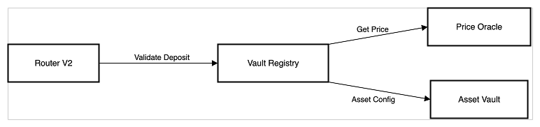

# ZeUSD Router V2

## Product Overview

The ZeUSD Router V2 serves as the primary entry point for user interactions with the ZeUSD protocol. It coordinates deposits, withdrawals, and protocol operations through a secure and compliant system.

## Core Components

### 1. Access Control System

1.1 Role-Based Access

* Integrated with AccessManager for role management
* Key roles:
  * WHITELISTER\_ROLE: Manages whitelisting and merkle roots
  * GUARDIAN\_ROLE: Emergency controls
  * TREASURY\_ROLE: Financial operations
  * ROUTER\_ROLE: For deposit/withdrawal operations
  * GATEKEEPER\_ROLE: For compliance operations
  * ORCHESTRATOR\_ROLE: For vault management

#### 1.2 User Access Management

```solidity
function setWhitelistStatus(address account, bool status) external;
function isWhitelisted(address account) external view returns (bool);
```

* Whitelist verification with merkle proofs
* Blacklist integration with ZeUSD token

### 2. Protocol Integration Components

#### 2.1 Vault Registry Integration

<figure><figcaption></figcaption></figure>

* Manages vault configurations
* Validates deposits against LTV ratios
* Coordinates with price oracles
* Tracks vault statuses

#### 2.2 [ZeUSD Token](zeusd-token.md) Management

```solidity
function deposit(
    address rwaAddress,
    address asset,
    uint256 amount
) external returns (uint256 tokenId, uint256 zeusdMinted);
```

### 3. Deposit Flow

<figure><figcaption></figcaption></figure>

### 4. Withdrawal Flow

<figure><figcaption></figcaption></figure>

## Error Handling

```solidity
error ZeUSDRouter_InvalidAddress(address addr);
error ZeUSDRouter_AssetNotSupported(address asset);
error ZeUSDRouter_Blacklisted(address account);
error ZeUSDRouter_ZeroAmount();
error ZeUSDRouter_NotNFTOwner();
error ZeUSDRouter_InvalidProof();
error ZeUSDRouter_NotWhitelisted(address account);

```

## Events

```solidity
event Deposit(
    address indexed user,
    uint256 indexed tokenId,
    address indexed asset,
    uint256 amount,
    uint256 zeusdMinted
);
```

## Security Features

* Whitelist verification with merkle proofs
* Integration with ZeUSD blacklist
* Role-based access control
* Input validation and bounds checking
* Emergency pause functionality

## Upgradeability

* Implements UUPS proxy pattern
* Managed through AccessManager
* Preserves state during upgrades
* Registry-based contract resolution


This updated documentation reflects the current implementation with:

* Removal of LayerZero and Chainlink CCIP references
* Updated role-based access control through AccessManager
* New withdrawal system integration
* CDP (ZeDP) NFT minting for position tracking
* Merkle proof-based whitelist verification
* Simplified deposit/withdrawal flows
* Current error handling system

The diagrams provide visual representation of the key flows and component interactions in the current implementation.

