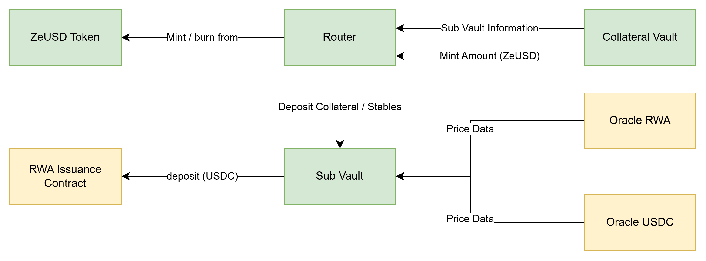

# The Hierarchical Architecture

Zoth’s architecture is structured as a hierarchical four-layer integrated financial stack that bridges institutional-grade fund management with decentralized blockchain technology.&#x20;

<figure><figcaption></figcaption></figure>
