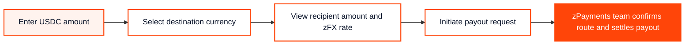

# zFX calculator

The zFX Calculator helps businesses estimate how much a recipient will receive when a stablecoin payout is settled into local currency through zPayments.

Enter a USDC amount, choose a supported destination currency, and zFX shows the local payout amount using the live zFX rate for that corridor.

Use it to check payout amounts before speaking with the zPayments team, sharing a quote internally, or embedding a simple payout calculator on your own website.

### What you can do with zFX

* Calculate recipient-side local currency amounts for USDC payouts
* Check live zFX rates across supported corridors
* View payout route details such as currency pair, fulfillment mode, and expected speed
* Embed the calculator on a website using a single iframe
* Start a payout request with the zPayments team

### Open the live tools

Calculator:[ zfx.web.app/calculator](https://zfx.web.app/calculator.html)

Global FX Rates board:[ zfx.web.app/rates](https://zfx.web.app/rates.html)

### How the calculator works



### How to read the Global FX Rates board

The rates board gives a live view of supported payout corridors.

| Column                  | Description                                                               |
| ----------------------- | ------------------------------------------------------------------------- |
| Destination Country     | The country or region where the recipient payout is available.            |
| Pair                    | The source and destination currency pair, such as USDC → INR.             |
| Best zFX Effective Rate | The live zFX rate currently available for that corridor.                  |
| 24H Change              | The rate movement over the last 24 hours.                                 |
| Fulfillment Mode        | The local payout method available for that corridor, such as bank payout. |
| Speed                   | The expected settlement speed for the corridor.                           |

### What the rate means

The zFX rate is the effective payout rate shown for the selected corridor.

It is designed to show the recipient-side amount more clearly than a standard mid-market FX calculator. Standard FX converters usually show reference rates, while the final payout amount can differ because of provider margins, route costs, or settlement fees.

zFX is built to show the payout rate more directly so businesses can understand what the recipient should receive before initiating the payout.

### Important note on live rates

Rates move with market and corridor liquidity conditions.

The calculator shows the live rate available at the time of viewing. Final payout details should be confirmed with the zPayments team before execution, especially for larger transfers, delayed settlement, or corridor-specific requirements.

### Supported corridors

The calculator currently supports USDC-based payout calculations for selected destination currencies.

The Global FX Rates board may also show additional base currency views and corridor data as new routes are added.

Check the live rates board for the latest supported corridors:

[View Global FX Rates](https://zfx.web.app/rates.html)

### Embedding the calculator

You can embed the zFX Calculator on any website with a single iframe.

No script, API key, or account setup is required.

```
<iframe
  src="https://zfx.web.app/calculator.html"
  width="100%"
  height="580"
  style="border: none; border-radius: 24px; max-width: 440px;"
  title="zFX Calculator">
</iframe>
```

#### WordPress

Add a Custom HTML block and paste the iframe snippet.

#### Wix or Squarespace

Add an Embed HTML element and paste the iframe snippet.

#### Custom website

Paste the iframe snippet into the page section where the calculator should appear.

### Embed specifications

| Setting       | Recommended value |
| ------------- | ----------------- |
| Width         | 100%              |
| Max width     | 440px             |
| Height        | 580px             |
| Border        | none              |
| Border radius | 24px              |
| Dependencies  | None              |

Keep the height at 580px. Smaller heights may crop the rate line or payout button.

### Common use cases

#### For businesses

Use zFX to estimate how much a contractor, vendor, supplier, or partner will receive in local currency before initiating a stablecoin payout.

#### For platforms

Embed the calculator to show users a simple stablecoin-to-local-currency payout estimate without building a custom FX interface.

#### For partners

Use the rates board to review corridor availability, expected payout speed, and current effective rates.

### Frequently asked questions

#### Is zFX a mid-market FX calculator?

No. zFX is designed to show the effective payout rate for supported zPayments corridors, not just a reference mid-market rate.

#### Is the calculator free?

Yes. The hosted calculator and embeddable widget are free to use.

#### Do I need an API key to embed it?

No. The widget can be embedded with a simple iframe and does not require an API key.

#### Does the calculator execute the payout automatically?

No. The calculator shows the payout amount and lets the user initiate a payout request. The zPayments team confirms the route, quote, compliance requirements, and settlement details before execution.

#### Which send currency does the calculator support?

The calculator currently uses USDC as the send currency.

#### How often do rates update?

The live rates board updates automatically. Check the page for the latest sync status and corridor-level rate data.

#### Who operates zFX?

zFX is a product by Zoth Payments Limited.

### Contact the payouts team

For corridor coverage, volume pricing, or onboarding, contact: zpayments@zoth.io


