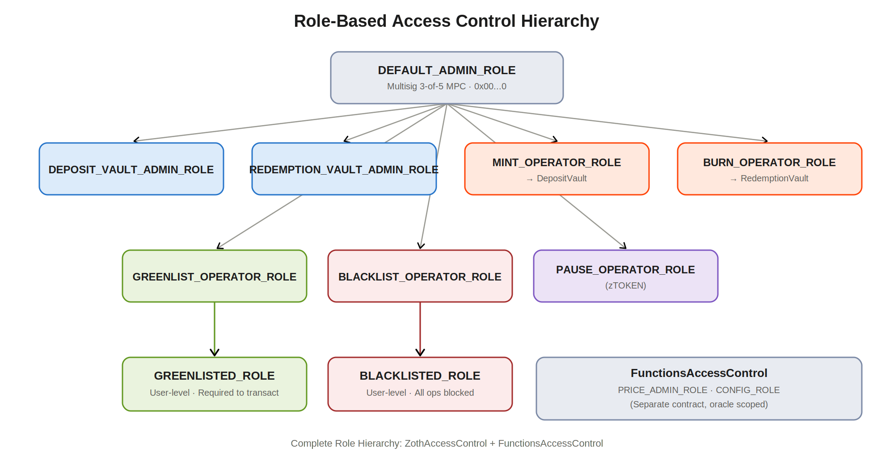

# Access Control

Every guarded action in the protocol checks a role against a single contract, `ZothAccessControl`. This concentrates risk by design: compromise of `ZothAccessControl` is compromise of the entire protocol, which is why the roles it administers are held by separate keys rather than any single one. The custody and signing model that enforces that separation is set out under Operational Security. Additionally, oracle roles live in a separate access-control contract, `FunctionsAccessControl`, so the price feed's authority does not share a control surface with the vaults.

<figure><figcaption></figcaption></figure>

#### ZothAccessControl Roles

| Role                            | Assigned to                | Capabilities                                                                                                                      |
| ------------------------------- | -------------------------- | --------------------------------------------------------------------------------------------------------------------------------- |
| `DEFAULT_ADMIN_ROLE` (0x00...0) | Protocol multisig          | Grant and revoke all roles. Update sanctions oracle. Emergency override. Transfer `ProxyAdmin`.                                   |
| `DEPOSIT_VAULT_ADMIN_ROLE`      | Ops wallet (MPC)           | Approve and reject deposit requests. Configure fees, limits, supply cap. Add and remove payment tokens. Pause `DepositVault`.     |
| `REDEMPTION_VAULT_ADMIN_ROLE`   | Ops wallet (MPC)           | Approve and reject redemption requests. Configure redemption fees. Set `requestRedeemer` address. Pause `RedemptionVault`.        |
| `GREENLIST_OPERATOR_ROLE`       | Compliance wallet (MPC)    | Grant or revoke `GREENLISTED_ROLE` for individual addresses.                                                                      |
| `BLACKLIST_OPERATOR_ROLE`       | Compliance wallet (MPC)    | Grant or revoke `BLACKLISTED_ROLE` for individual addresses.                                                                      |
| `GREENLISTED_ROLE`              | Greenlisted user wallet    | Required to call `depositInstant`, `depositRequest`, `redeemInstant`, `redeemRequest`. Fiat redemptions always require this role. |
| `BLACKLISTED_ROLE`              | Blocked wallet             | Prevents deposits, redemptions, and `zTOKEN` transfers, both send and receive.                                                    |
| `MINT_OPERATOR_ROLE`            | `DepositVault` contract    | Can call `zTOKEN.mint()`. Assigned automatically to `DepositVault` at deployment.                                                 |
| `BURN_OPERATOR_ROLE`            | `RedemptionVault` contract | Can call `zTOKEN.burn()`. Assigned automatically to `RedemptionVault` at deployment.                                              |
| `PAUSE_OPERATOR_ROLE`           | Ops wallet (MPC)           | Can call `zTOKEN.pause()` and `unpause()` to halt all token transfers.                                                            |

#### FunctionsAccessControl Roles (Oracle)

| Role                 | Assigned to             | Capabilities                                                                                   |
| -------------------- | ----------------------- | ---------------------------------------------------------------------------------------------- |
| `DEFAULT_ADMIN_ROLE` | Protocol multisig       | Manage `PRICE_ADMIN` and CONFIG roles within `FunctionsAccessControl`.                         |
| `PRICE_ADMIN_ROLE`   | NAV update wallet (MPC) | Call `setPrice()` on `PriceOracle`. Must be a dedicated MPC wallet separate from vault admins. |
| `CONFIG_ROLE`        | Ops wallet (MPC)        | Modify oracle parameters: `tolerancePercent`, `priceDecimals`, `maxStaleness`.                 |
