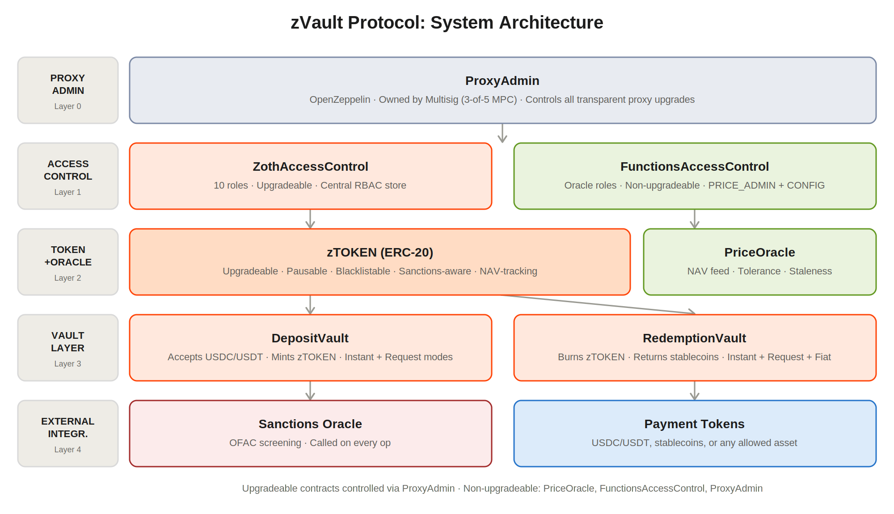

# Contracts

The protocol stacks into five horizontal layers, from upgrade control at the top to external integrations at the bottom.

<figure><figcaption></figcaption></figure>

| Layer            | Contracts                                     | Responsibility                                                                                                                     |
| ---------------- | --------------------------------------------- | ---------------------------------------------------------------------------------------------------------------------------------- |
| Proxy            | `ProxyAdmin`                                  | Owns all upgradeable proxies. Multisig-controlled. Enables upgrades without state migration                                        |
| Access control   | `ZothAccessControl`, `FunctionsAccessControl` | Single source of truth for roles. `ZothAccessControl` governs vault and token roles; `FunctionsAccessControl` governs oracle roles |
| Token and oracle | `zTOKEN`, `PriceOracle`                       | The ERC-20 NAV-share token (upgradeable) and the non-upgradeable NAV price feed                                                    |
| Vault layer      | `DepositVault`, `RedemptionVault`             | `DepositVault` mints the `zTOKEN` against deposits; `RedemptionVault` burns it and returns deposit asset                           |
| External         | `Screener`                                    | Screens addresses and correctly identifies risks before authorizing transactions                                                   |

| Contract                 | Type   | Upgradeable | Purpose                                                |
| ------------------------ | ------ | ----------- | ------------------------------------------------------ |
| `ZothAccessControl`      | Access | Yes (proxy) | Central role management for all contracts              |
| `zTOKEN`                 | Token  | Yes (proxy) | ERC-20 interest-bearing token with compliance controls |
| `DepositVault`           | Vault  | Yes (proxy) | Accepts deposits, mints the `zTOKEN`                   |
| `RedemptionVault`        | Vault  | Yes (proxy) | Burns the `zTOKEN`, returns deposit assets             |
| `PriceOracle`            | Oracle | No          | NAV price feed with tolerance and staleness checks     |
| `FunctionsAccessControl` | Access | No          | Role management scoped to the oracle                   |
| `ProxyAdmin`             | Admin  | No          | Controls all proxy upgrades                            |
