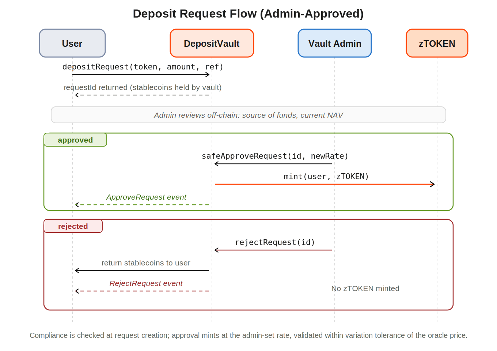

# Deposit Flow

### Deposit Flow

A deposit mints the vault's `zTOKEN` against accepted stablecoins. Two paths exist, both minting the same token.

| Path            | When used                                                                 | Outcome                                                                                                                                                     |
| --------------- | ------------------------------------------------------------------------- | ----------------------------------------------------------------------------------------------------------------------------------------------------------- |
| Instant deposit | Default path for standard deposits                                        | Compliance and slippage checks pass, any fee is separated, and the `zTOKEN` is minted to the user in a single transaction                                   |
| Request deposit | Large deposits above the daily instant limit, or where review is required | Stablecoins are held and a pending request is created with no tokens minted, until the fund admin approves at the current rate; rejection returns the funds |

Whether a vault offers the instant path, the request path, or both is entirely the fund manager's choice. The contracts support either, so the deposit model is configured to match the vault's strategy and review requirements rather than fixed by the protocol.

#### Instant Deposit

On the instant path the user sets a minimum acceptable output, so the mint reverts if the NAV moves unfavorably between quote and execution. Deposited capital is then deployed into the vault's strategy by the fund manager and begins generating yield. The full sequence is shown below.

#### Request Deposit

The request path is used for large deposits above the daily instant limit, or when admin review is required. The user's stablecoins are held by the vault until the request is resolved. Compliance is checked at request creation; on approval the vault mints at the admin-set rate, validated against the oracle within variation tolerance. The flow has two outcomes, approve and reject.

<figure><figcaption></figcaption></figure>

| Step         | Actor          | Action                                                                                                                                                                      |
| ------------ | -------------- | --------------------------------------------------------------------------------------------------------------------------------------------------------------------------- |
| 1            | User           | Call `depositRequest(token, amount, referrerId)`. Stablecoins transferred to the vault. `requestId` returned.                                                               |
| 2            | `DepositVault` | Create a pending request object. No tokens minted yet. Emit `DepositRequest` event.                                                                                         |
| 3            | Admin          | Review the request off-chain. Validate source of funds and current NAV.                                                                                                     |
| 4a (approve) | Vault Admin    | Call `safeApproveRequest(requestId, newRate)`. Rate must be within `variationTolerance` of the oracle price. If valid, mint `zTOKEN` to the user and emit `ApproveRequest`. |
| 4b (reject)  | Vault Admin    | Call `rejectRequest(requestId)`. Stablecoins returned to the user. No `zTOKEN` minted. Emit `RejectRequest`.                                                                |
