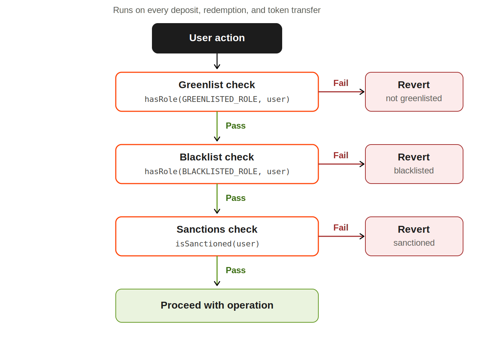

# Gating in zVaults

Every deposit, redemption, and token transfer in a zVault passes through a compliance sequence before it executes. The sequence has three gates, checked in order, and a failure at any gate reverts the entire transaction:

<figure><figcaption></figcaption></figure>

| Gate      | Controls                                       | Default state                                 | On failure               |
| --------- | ---------------------------------------------- | --------------------------------------------- | ------------------------ |
| Greenlist | Who is permitted to enter                      | Configurable per vault (off = permissionless) | Reverts: not greenlisted |
| Blacklist | Which addresses are blocked                    | Always on                                     | Reverts: blacklisted     |
| Sanctions | OFAC-sanctioned addresses, via external oracle | Always on                                     | Reverts: sanctioned      |

Greenlisting and blacklisting are inverses. Greenlisting is an opt-in allowlist that a vault can switch on to restrict participation to an approved set. Blacklisting is an always-on blocklist that bars specific bad addresses. The sanctions gate sits alongside both as an automated external check.
